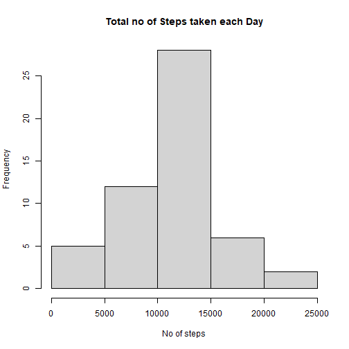
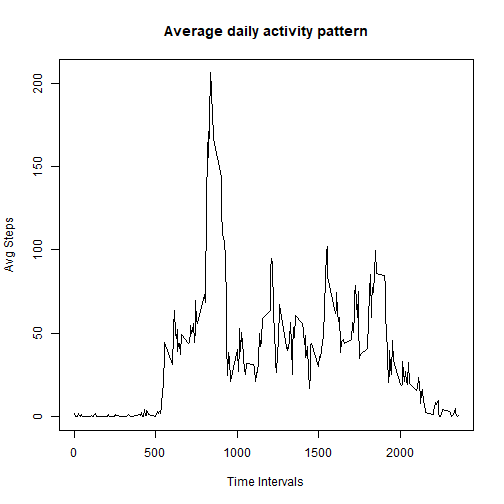
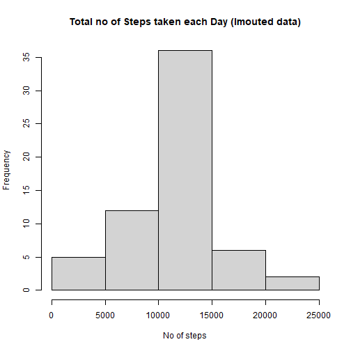
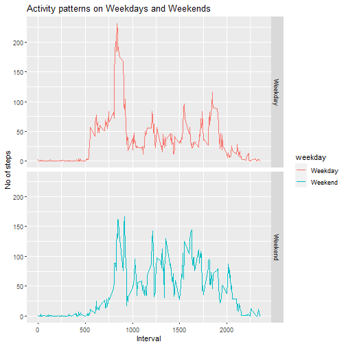

## Loading necessary libraries

```r
library(dplyr)
library(ggplot2)
```


## Loading and preprocessing the data

```r
df_activity <- read.csv("./data/activity.csv")
str(df_activity)
```

```
## 'data.frame':	17568 obs. of  3 variables:
##  $ steps   : int  NA NA NA NA NA NA NA NA NA NA ...
##  $ date    : chr  "2012-10-01" "2012-10-01" "2012-10-01" "2012-10-01" ...
##  $ interval: int  0 5 10 15 20 25 30 35 40 45 ...
```

Converting date data to proper date format

```r
df_activity$date <- as.Date(df_activity$date)
```

Removing NA values and storing in a new data frame

```r
df_activity_clean <- df_activity[complete.cases(df_activity), ]
```


## What is mean total number of steps taken per day?

```r
stepsPerDay <- df_activity_clean %>% 
    group_by(date) %>% 
    summarise(totsteps = sum(steps))

hist(stepsPerDay$totsteps, main = "Total no of Steps taken each Day", xlab = "No of steps")
```



Mean and Median steps of the total no of steps taken per day

```r
mean(stepsPerDay$totsteps)
```

```
## [1] 10766.19
```

```r
median(stepsPerDay$totsteps)
```

```
## [1] 10765
```


## What is the average daily activity pattern?

```r
intervalActivity <- df_activity_clean %>% 
    group_by(interval) %>% 
    summarise(avgSteps = mean(steps))

plot(x = intervalActivity$interval, y = intervalActivity$avgSteps, type = "l", main = "Average daily activity pattern", xlab = "Time Intervals", ylab = "Avg Steps")
```



5-minute interval that contains the max no of steps on avg

```r
intervalActivity[which.max(intervalActivity$avgSteps),]
```

```
## # A tibble: 1 x 2
##   interval avgSteps
##      <int>    <dbl>
## 1      835     206.
```


## Imputing missing values
No of missing values

```r
sum(is.na(df_activity))
```

```
## [1] 2304
```

Filling missing values

```r
df_activity_impute <- df_activity

for(i in 1:nrow(df_activity_impute)) {
    if(is.na(df_activity_impute$steps[i])) {
       interval_i <- df_activity_impute$interval[i]
       fillValue <- intervalActivity[which(intervalActivity$interval == interval_i) ,]$avgSteps
       df_activity_impute$steps[i] <- fillValue
    }
}
```

Plotting with imputed data

```r
stepsPerDay2 <- df_activity_impute %>% 
    group_by(date) %>% 
    summarise(totsteps = sum(steps))

hist(stepsPerDay2$totsteps, main = "Total no of Steps taken each Day (Imouted data)", xlab = "No of steps")
```




Mean and Median steps of the total no of steps taken per day

```r
mean(stepsPerDay2$totsteps)
```

```
## [1] 10766.19
```

```r
median(stepsPerDay2$totsteps)
```

```
## [1] 10766.19
```

We can see that the Mean and Median values have roughly remained the same  even after imputing the missing values


## Are there differences in activity patterns between weekdays and weekends?

```r
df_activity_wkdy <- df_activity_impute %>% 
    mutate(weekday = as.factor(ifelse(weekdays(date) == "Saturday" | weekdays(date) == "Sunday", "Weekend", "Weekday")))


intervalActivity2 <- df_activity_wkdy %>% 
    group_by(interval, weekday) %>% 
    summarise(avgSteps = mean(steps))
```

```
## `summarise()` has grouped output by 'interval'. You can override using the `.groups` argument.
```

```r
g <- ggplot(intervalActivity2, aes(interval, avgSteps))
g + geom_line(aes(color = weekday)) + facet_grid(weekday~.) + labs(title = "Activity patterns on Weekdays and Weekends", x = "Interval", y = "No of steps")
```



We can observe that on Weekends the individual's steps don't peak during the morning like they do during weekdays but throughout the rest of day, during weekends, there seems to be more activity on average than weekdays
